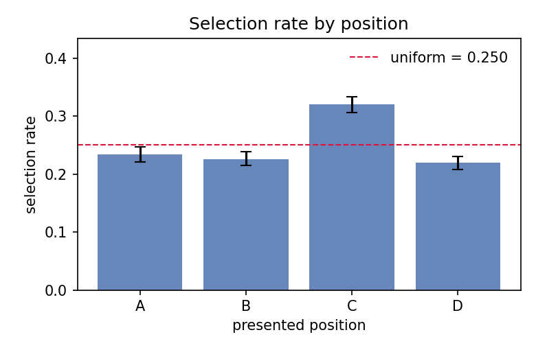

# choice-eval-toolkit

[](https://github.com/SCUTxyx/choice-eval-toolkit/actions/workflows/test.yml)
[](https://github.com/SCUTxyx/choice-eval-toolkit)
[](LICENSE)
[](#verified-against-known-injected-biases)

**Audit multiple-choice evaluation runs for position/label bias, length bias and ordering
instability — and check whether the model's stated confidence actually means anything.**

Multiple-choice (MCQ) evaluation is quietly fragile. Models develop slot preferences (a
model that over-picks **C**), grab the longest option, or answer differently when the same
options are shuffled — and a benchmark whose answer key is itself imbalanced makes all of
this worse. A single accuracy number hides all of it. This toolkit takes an evaluation log
and tells you, with hypothesis tests and confidence intervals, whether any of these failure
modes are present in *your* run — and what to do about them.

Everything is plain statistics: **no model calls, no GPU, no external APIs, no datasets**.
The core is numpy + scipy; figures use matplotlib. Missing inputs degrade to clearly marked
skipped sections rather than errors — the toolkit audits whatever you logged.

## What it audits

| Audit | Statistic | Output |
|---|---|---|
| **Position bias (marginal)** | χ² goodness-of-fit of selection rates vs uniform, Cohen's w, per-position excess with cluster-bootstrap CIs | verdict + which slot is over-picked |
| **Position bias (gold-offset)** | χ² GOF of `(selected − gold) mod K` among wrong answers — **immune to answer-key imbalance** | confound-free model-side verdict |
| **Answer-key balance** (dataset side) | χ² GOF of gold positions vs uniform | flags imbalanced benchmarks |
| **Length bias** | selection rate by option-length rank (χ²) + mean length z-score of the picked option (within-question paired t-test) | verdict + longest/shortest preference |
| **Gold-length artifact** (dataset side) | χ² GOF of the gold answer's length rank | flags "longest answer is correct" benchmarks |
| **Ordering consistency** | same-answer-content rate across shuffled orderings, per-question chance level | detects order-sensitive models |
| **Directional ordering asymmetry** | variant-label permutation test (exact McNemar when V = 2) | catches canonical-order memorization |
| **Confidence calibration** | ECE / MCE (equal-width or equal-mass bins), reliability diagram, bootstrap CI | over- vs under-confidence |
| **Confidence discrimination** | AUROC of confidence for correctness | calibration ≠ discrimination; both are reported |
| **Selective prediction** | risk–coverage curve, AURC / E-AURC, maximum-coverage confidence threshold for a target risk | operational abstention rule |

Statistical design, in three lines: all confidence intervals are **cluster bootstrap**
percentile intervals with questions as clusters (re-ordered variants of one question move
together); all hypothesis tests use **one ordering per question** so rows are independent —
conservative on multi-ordering runs, never anti-conservative. The directional ordering test
is a **variant-label permutation test**, because pooling correlated pairs into exact
McNemar (as most quick scripts do) overstates significance. The two position tests cover
each other's confounds: the marginal test assumes a balanced key, the gold-offset test is
immune to key imbalance but blind to absolute slot attraction under a balanced key — when
they disagree and the key is imbalanced, the report says *inconclusive* instead of guessing.

## Install

```bash
pip install git+https://github.com/SCUTxyx/choice-eval-toolkit.git   # from GitHub
# or, from a clone:
pip install -e .          # numpy, scipy, matplotlib
```

Requires Python ≥ 3.9 (CI tests 3.9–3.12).

## Quickstart

**1. Generate two synthetic demo runs and their audit reports** (a clean model and a model
with five injected pathologies), written to `examples/`:

```bash
python -m choice_eval demo --out examples --n 1200 --variants 4
```

**2. Audit your own evaluation log:**

```bash
python -m choice_eval audit my_run.jsonl --out my_report --binning equal_mass
```

Each run produces a `report.md`, four figures, and a machine-readable `results.json`:

| Section | Clean demo run | Biased demo run |
|---|---|---|
| Position bias (marginal) | none (p = 0.95) | **moderate** — option C over-picked, excess +0.094 [0.077, 0.112], p = 0.001 |
| Position bias (gold-offset) | none (p = 0.80) | none (p = 0.54) — absolute-slot pull with a balanced key |
| Length bias | none (p = 0.58) | **moderate** — longest option 0.312 vs uniform 0.250, p < 1e-6 |
| Ordering consistency | 0.909, mostly stable | **0.551, unstable** |
| Ordering × correctness | symmetric (p = 1.0) | **systematic direction** (permutation p = 0.002) |
| Calibration | ECE 0.039, slightly miscalibrated | **ECE 0.190, overconfident / poorly calibrated** |
| Confidence AUROC | 0.793 | 0.752 |
| Selective prediction | threshold 0.37 → 58% coverage @ 15% risk | no deployable threshold reaches 15% risk — recalibrate first |

Side-by-side reports live in [`examples/clean/`](examples/clean/report.md) and
[`examples/biased/`](examples/biased/report.md).



## Input schema

JSONL, one response per line — one (question, option-ordering) observation:

```json
{"question_id": "q00042", "n_options": 4, "gold_index": 2, "selected_index": 0,
 "confidence": 0.83, "option_lengths": [41, 87, 63, 30],
 "option_ids": ["q00042_opt1", "q00042_opt0", "q00042_opt3", "q00042_opt2"],
 "variant_id": "shuffle_2"}
```

| Field | Required | Meaning |
|---|---|---|
| `question_id` | ✓ | groups re-ordered variants of the same question |
| `n_options` | ✓ | number of options (must be constant within a run) |
| `gold_index` | ✓ | position of the correct option **in this presentation order** |
| `selected_index` | ✓ | position chosen; `null` = abstain / unparsable |
| `confidence` |  | stated probability for the selected answer, in [0, 1] |
| `option_lengths` |  | character length of each presented option (enables the length audit) |
| `option_ids` |  | content identity of each presented option (enables the ordering audit) |
| `variant_id` |  | which reordering this is (e.g. `canonical`, `shuffle_1`, ...) |

Logging tips: record `option_ids` so answers can be matched by *content* across orderings;
ask each question under 2+ shuffled orderings if you want the ordering audit; include
`option_lengths` to expose length artifacts. Each (question, ordering) pair may appear at
most once — duplicate records are rejected with a clear error.

## Verified against known injected biases

Because the toolkit ships a generator that injects biases with **known magnitude**, its
correctness is checkable without any external ground truth: inject a bias, confirm the
audit recovers it. `tests/` (53 tests) does exactly this — including closed-form checks
that the recovered selection-rate *vectors* match the generative model's prediction, and
regression tests that the reported abstention threshold is exactly what the deployable
`conf ≥ t` rule achieves — and `demo/recovery_table.py` reproduces this table:

| Injected bias | Generator knob | Designed effect | Recovered (95% CI) | Verdict |
|---|---|---|---|---|
| Position pull toward option C | `position_attract={2: 0.30}` | +0.077 excess at C | +0.082 [+0.065, +0.097] | p = 2e-28 → moderate |
| Longest-option pull | `length_attract=0.25` | +0.063 excess at longest rank | +0.055 [+0.040, +0.070] | p = 6e-15 → moderate |
| Overconfident answers | `confidence_shift=0.18` | large positive ECE, `overconfident` | ECE 0.132 [0.122, 0.141] | overconfident → moderately miscalibrated |
| Canonical-order memorization | `canonical_bonus=0.12` | -0.066 accuracy drop on shuffles | -0.069 measured drop | permutation p < 2e-03 → systematic |
| Neighbor-of-gold pull (offset +2) | `offset_attract={2: 0.30}` | 0.533 share at offset +2 (uniform 0.333) | 0.525 [0.502, 0.543] | p = 2e-83 → severe |

Run the suite with `pytest` (about ten seconds; everything is synthetic).

## Using it as a library

```python
from choice_eval import load_jsonl, run_audit, write_report, write_results_json

run = load_jsonl("my_run.jsonl")           # or build EvalRun in code
bundle = run_audit(run, n_boot=1000)       # all audits at once
bundle.position.verdict                    # "none" | "minor" | "moderate" | "severe"
bundle.position.excess                     # per-position selection excess
bundle.calibration.ece_ci                  # bootstrap CI for ECE
bundle.calibration.auroc                   # discrimination of the confidence signal
bundle.abstention.suggested_threshold      # confidence cutoff for a target risk
write_report(bundle, "my_report/")         # report.md + figures + results.json
```

Individual audits (`audit_position`, `audit_length`, `audit_order`, `audit_calibration`,
`audit_abstention`), the synthetic generator (`generate_run`), and its closed-form ground
truth (`expected_selection_rates`) are all importable.

## Metric notes

- **ECE** — Σ over confidence bins of (bin share) × |bin accuracy − bin mean confidence|.
  Equal-width bins are the default; `--binning equal_mass` gives quantile bins when
  confidence piles up at 0.99. ECE is mildly upward-biased at small n; the report shows
  per-bin counts so sparse bins are visible.
- **AUROC** — probability that a random correct answer got higher confidence than a random
  wrong one. Calibration and discrimination fail independently; reporting both prevents
  the common misreading of a well-discriminating-but-overconfident model as "calibrated".
- **Cohen's w** — √(χ²/N) effect size for the χ² tests; verdicts combine p < 0.01 with
  w thresholds (0.05 / 0.10 / 0.21 → none / minor / moderate / severe). With ten audits
  per report, treat borderline p-values with the family of tests in mind and lean on
  effect sizes and CIs.
- **Gold-offset test** — among wrong answers, `(selected − gold) mod K` must be uniform
  over the non-zero offsets for a position-blind model, whatever the answer key looks
  like. This is what makes it immune to key imbalance; the flip side is that an absolute
  slot attractor under a *balanced* key spreads evenly across offsets, which is why the
  marginal test is kept and the report combines both.
- **AURC / E-AURC** — area under the risk–coverage curve when answers are sorted by stated
  confidence; E-AURC is the excess over the oracle ordering (all correct answers first).
- **Variant-permutation test** — under the null, variant labels are exchangeable within
  each question; the test re-randomizes which row plays which variant and recomputes the
  directional asymmetry. Valid for any number of orderings; reduces to exact McNemar for
  two.
- **Chance consistency** — the ordering audit reports the per-question probability that two
  random picks coincide, so a 0.6 consistency on a 4-option question isn't mistaken for signal.

## Limitations

- One option count per run (4-way MCQ is the target case; mixed-K logs are rejected with a
  clear error).
- One record per (question, ordering); repeated samples of the same ordering must be
  aggregated first.
- The ordering audit needs `option_ids`; the length audit needs `option_lengths`. Without
  them those sections are skipped with an explanation rather than guessed.
- Verdict thresholds (w cutoffs, α = 0.01) are defaults, not laws — the point estimates,
  CIs and JSON are there for your own judgement.

## Project layout

```
choice_eval/
  schema.py        data model + JSONL I/O
  generators.py    synthetic runs with injectable, known biases + closed-form ground truth
  position.py      position/label bias + answer-key balance
  length.py        length bias + gold-length artifact
  order.py         ordering consistency + variant-permutation directional test
  calibration.py   ECE / MCE / reliability diagram / AUROC
  abstention.py    risk–coverage, AURC, threshold optimization
  report.py        Markdown report + figures + JSON export
  cli.py           `choice-eval audit` / `choice-eval demo`
tests/             46 tests incl. closed-form injection-recovery checks
demo/              recovery_table.py — regenerates the README table
examples/          demo output: two reports + figures + results.json
```

## Cite

If this toolkit is useful in your work, please star the repo and cite:

```bibtex
@software{scutxyx2026choiceeval,
  title  = {choice-eval-toolkit: Bias Audit and Calibration Checks for
            Multiple-Choice Evaluation},
  author = {SCUTxyx},
  year   = {2026},
  url    = {https://github.com/SCUTxyx/choice-eval-toolkit},
  version= {0.3.0}
}
```

## References

- Zheng, L. et al. *Large Language Models Are Not Robust Multiple Choice Selectors*. ICLR 2024.
- Guo, C. et al. *On Calibration of Modern Neural Networks*. ICML 2017.
- Geifman, Y. & El-Yaniv, R. *Selective Prediction: A New View of Classification (and Regression)*. 2017.
- Peyrard, M. et al. *Investigating the Simplest Case of Position Bias*. 2021.
- Efron, B. & Tibshirani, R. *An Introduction to the Bootstrap*. 1993.

## License

MIT — see [LICENSE](LICENSE).
