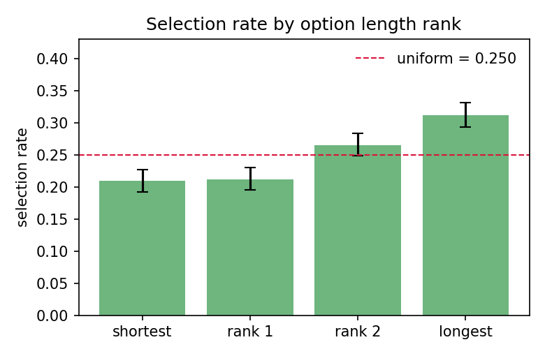
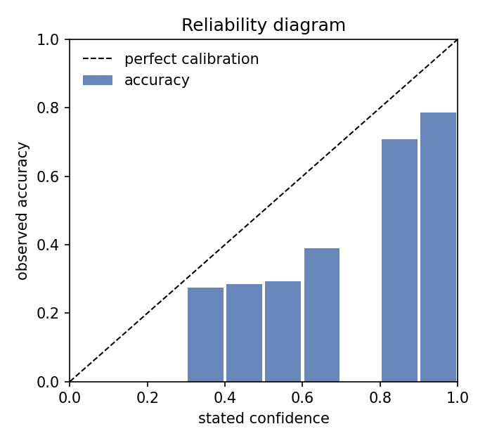
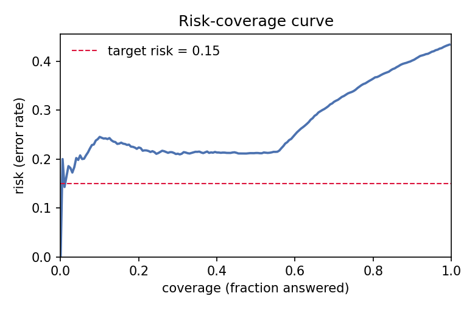

# Bias & Calibration Audit — demo-biased

*Generated 2026-09-26 · 4800 responses · 1200 questions · 4 ordering(s) · 4 options · abstain/unparsable rate 0.0% · accuracy 56.5%*

*Toolkit v0.3.1 · B = 1000 bootstrap / 1000 permutations · seed 0 · 10 equal_width calibration bins · α = 0.01 · target risk 15% — machine-readable results in `results.json`.*

## Summary

| Audit | Key statistic | Value | p-value | Verdict |
|---|---|---|---|---|
| Position bias (marginal) | χ² GOF vs uniform (Cohen's w = 0.116) | χ² = 16.2 | 0.0010 | **moderate** |
| Position bias (gold-offset, confound-free) | χ² GOF of (sel − gold) mod K among wrongs (w = 0.051) | χ² = 1.2 | 0.5386 | **none** |
| Answer-key balance (dataset) | χ² GOF vs uniform (w = 0.065) | χ² = 5.1 | 0.1679 | **none** |
| Length bias | χ² GOF by length rank (w = 0.197) | χ² = 46.5 | < 1e-6 | **moderate** |
| Length artifact (dataset) | gold-at-length-rank GOF | — | 0.6340 | **balanced** |
| Ordering consistency | same content across orderings | 0.551 [0.535, 0.569] | — | **unstable** |
| Ordering × correctness | variant-permutation test on paired correctness | χ² = 23.2 | 0.0020 | **systematic direction** |
| Calibration | ECE (equal_width, 10 bins) | 0.190 [0.175, 0.204] | — | **poorly calibrated** |
| Confidence discrimination | AUROC (confidence → correctness) | 0.752 [0.735, 0.769] | — | — |
| Selective prediction | AURC / E-AURC | 0.272 / 0.160 | — | — |

## 1. Position / label bias

Selection rates by presented position, with cluster-bootstrap 95% CIs (resampling questions, so re-ordered variants of one question move together):

| Position | Selection rate | 95% CI | Excess vs other positions |
|---|---|---|---|
| A | 0.234 | [0.221, 0.247] | -0.022 [-0.038, -0.006] |
| B | 0.226 | [0.214, 0.238] | -0.032 [-0.048, -0.017] |
| C | 0.321 | [0.307, 0.334] | +0.094 [+0.077, +0.112] |
| D | 0.219 | [0.208, 0.231] | -0.041 [-0.056, -0.026] |

χ²(3) = 16.2, p = 0.0010, Cohen's w = 0.116 → **moderate**. First-position selection rate: 0.234 (uniform would be 0.250). This marginal test assumes a balanced answer key (§2); with an imbalanced key, read the gold-offset test below instead.

### Gold-offset test (confound-free)

Among wrong answers, a position-blind model selects uniformly over the K−1 slots *relative to the gold one*: `(selected − gold) mod K` must be uniform over the non-zero offsets — independent of answer-key balance and accuracy. n = 467 wrong answers (one ordering per question):

| Offset (sel − gold) | +1 | +2 | +3 |
|---|---|---|---|
| Selection share | 0.321 | 0.358 | 0.321 |
| 95% CI low | 0.281 | 0.317 | 0.281 |
| 95% CI high | 0.364 | 0.405 | 0.362 |

Uniform would be 0.333 per offset. χ²(2) = 1.2, p = 0.5386, w = 0.051 → **none**.

### Accuracy by gold position

If the model were position-blind, accuracy would not depend on where the correct answer sits (given a balanced key):

| Gold at | A | B | C | D |
|---|---|---|---|---|
| Accuracy | 0.644 | 0.614 | 0.579 | 0.605 |

Homogeneity χ² p = 0.4103.

## 2. Answer-key balance (dataset side)

| Gold at | A | B | C | D |
|---|---|---|---|---|
| Share of questions | 0.269 | 0.246 | 0.259 | 0.226 |

χ²(3) = 5.1, p = 0.1679 → **none**. An imbalanced key inflates position bias: a model with a matching slot preference scores better than it deserves.

## 3. Length bias

| Statistic | shortest | rank 1 | rank 2 | longest |
|---|---|---|---|---|
| Selection rate | 0.210 | 0.212 | 0.265 | 0.312 |
| Gold share (dataset) | 0.237 | 0.246 | 0.257 | 0.261 |

Selection by rank: χ²(3) = 46.5, p = < 1e-6, w = 0.197 → **moderate**. Mean length z-score of the selected option = +0.147 [+0.107, +0.189], one-sample t-test p = < 1e-6. Gold-at-rank balance: p = 0.6340 → **balanced**.

## 4. Ordering consistency

Across 7200 ordered pairs from 1200 multi-variant questions: same-answer-content rate = **0.551** [0.535, 0.569] (per-question chance level ≈ 0.353); same-correctness rate = 0.698. Directional asymmetry: McNemar χ² = 23.2 on pooled pairs, variant-permutation p = 0.0020 → **systematic direction**.

Accuracy by ordering (a spread here is the practical footprint of order sensitivity):

| Ordering | n | Accuracy |
|---|---|---|
| canonical | 1200 | 0.611 |
| shuffle_1 | 1200 | 0.546 |
| shuffle_2 | 1200 | 0.560 |
| shuffle_3 | 1200 | 0.543 |

## 5. Confidence calibration

Accuracy = 0.565, mean stated confidence = 0.755 → model is **overconfident**. ECE = **0.190** [0.175, 0.204], MCE = 0.240 → **poorly calibrated** (equal_width binning, 10 bins, n = 4800).

Discrimination: confidence AUROC = **0.752** [0.735, 0.769] — probability that a random correct answer received higher confidence than a random wrong one. Calibration and discrimination are independent: a model can fail one and pass the other.

## 6. Selective prediction (abstention)

Sorting answers by stated confidence: AURC = 0.272, E-AURC = 0.160.

No confidence level achieves risk ≤ 15% on this run — selective prediction cannot meet the target.

## Recommendations

- Position bias detected (largest marginal excess at **C**, +0.094). Report accuracy averaged over cyclic (or random) permutations of the options, or debias before comparing models.
- Length bias detected: control for option length (e.g. stratify accuracy by the gold option's length rank) or permute option order by length.
- Low ordering consistency: the reported score depends on which ordering you used. Average over orderings and report consistency alongside accuracy.
- Systematic correctness direction across orderings (often canonical-order memorization): treat single-order scores as optimistic.
- Calibration is overconfident: consider temperature scaling on held-out data. Confidence is too miscalibrated for thresholding — recalibrate first.

## Method notes

- All CIs are cluster bootstrap percentile intervals (B = 1000 by default) with questions as clusters.
- χ² and t-tests use one ordering per question: re-ordered variants of the same question are strongly correlated, and testing on all rows would overstate significance. This makes the test conservative on multi-variant runs; rates and CIs use every response.
- χ² tests use α = 0.01; effect size is Cohen's w (0.1 / 0.2 / 0.3 ≈ small / medium / large). Multiple audits are reported per run, so treat borderline p-values with the family of tests in mind and lean on effect sizes and CIs.
- The two position tests cover each other's confounds: the marginal test assumes a balanced answer key, while the gold-offset test (uniformity of `(selected − gold) mod K` among wrong answers) is immune to key imbalance and accuracy — but blind to absolute slot attraction when the key is balanced. Read them together; the combined verdict takes the more severe of the two.
- The directional ordering p-value is a variant-label permutation test (1000 permutations): under the null, variant labels are exchangeable within each question, which handles the correlated pairs that would break exact McNemar on multi-ordering runs.
- E-AURC is the excess risk-coverage area over the oracle ordering (all correct answers first); smaller is better, 0 is unattainable in practice.
- ECE is mildly upward-biased at small n (finite-sample noise inside bins); the reliability diagram and per-bin counts let you judge when bins are too sparse.
- Abstain/unparsable answers are excluded from position, length and calibration statistics and counted in the abstain rate.
- Equal-width bins can be noisy at the extremes; pass `--binning equal_mass` for quantile bins.
