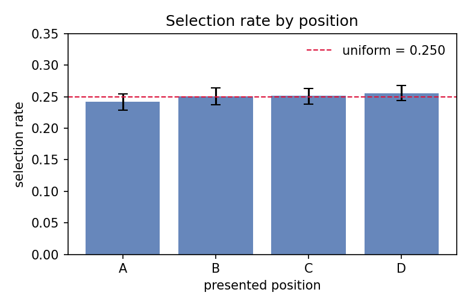
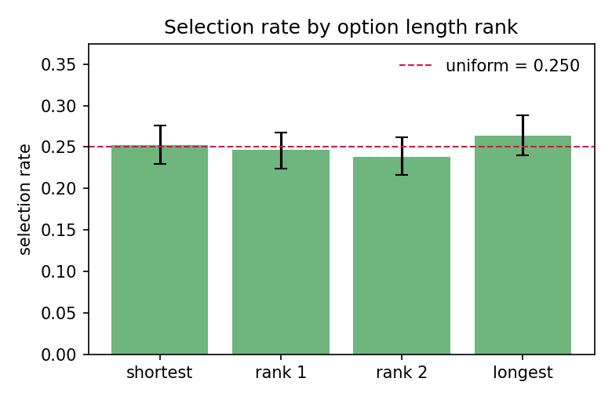
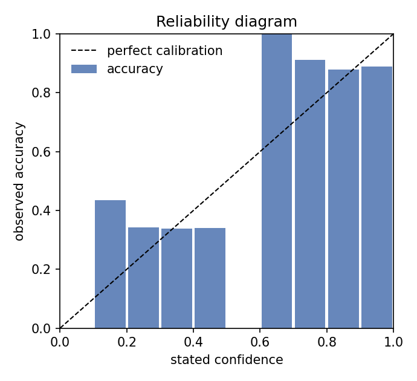
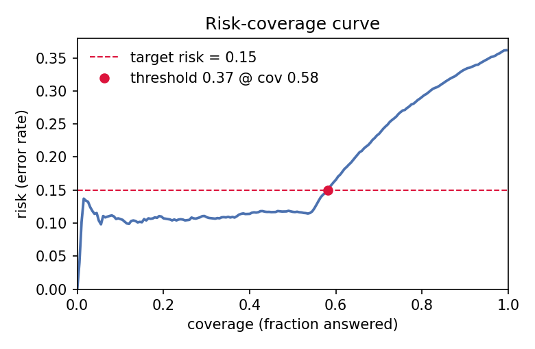

# Bias & Calibration Audit — demo-clean

*Generated 2026-09-26 · 4800 responses · 1200 questions · 4 ordering(s) · 4 options · abstain/unparsable rate 0.0% · accuracy 63.7%*

*Toolkit v0.2.0 · B = 1000 bootstrap / 1000 permutations · seed 0 · 10 equal_width calibration bins · α = 0.01 · target risk 15% — machine-readable results in `results.json`.*

## Summary

| Audit | Key statistic | Value | p-value | Verdict |
|---|---|---|---|---|
| Position bias | χ² GOF vs uniform (Cohen's w = 0.017) | χ² = 0.3 | 0.9536 | **none** |
| Answer-key balance (dataset) | χ² GOF vs uniform (w = 0.036) | χ² = 1.5 | 0.6715 | **none** |
| Length bias | χ² GOF by length rank (w = 0.041) | χ² = 2.0 | 0.5752 | **none** |
| Length artifact (dataset) | gold-at-length-rank GOF | — | 0.2747 | **balanced** |
| Ordering consistency | same content across orderings | 0.909 [0.897, 0.921] | — | **mostly stable** |
| Ordering × correctness | variant-permutation test on paired correctness | χ² = 0.0 | 1.0000 | **symmetric** |
| Calibration | ECE (equal_width, 10 bins) | 0.039 [0.032, 0.059] | — | **slightly miscalibrated** |
| Confidence discrimination | AUROC (confidence → correctness) | 0.793 [0.768, 0.816] | — | — |
| Selective prediction | AURC / E-AURC | 0.181 / 0.105 | — | — |

## 1. Position / label bias

Selection rates by presented position, with cluster-bootstrap 95% CIs (resampling questions, so re-ordered variants of one question move together):

| Position | Selection rate | 95% CI | Excess vs other positions |
|---|---|---|---|
| A | 0.242 | [0.229, 0.254] | -0.011 [-0.027, +0.005] |
| B | 0.251 | [0.237, 0.264] | +0.001 [-0.016, +0.018] |
| C | 0.251 | [0.239, 0.263] | +0.002 [-0.014, +0.018] |
| D | 0.256 | [0.244, 0.268] | +0.007 [-0.008, +0.023] |

χ²(3) = 0.3, p = 0.9536, Cohen's w = 0.017 → **none**. First-position selection rate: 0.242 (uniform would be 0.250).

### Accuracy by gold position

If the model were position-blind, accuracy would not depend on where the correct answer sits (given a balanced key):

| Gold at | A | B | C | D |
|---|---|---|---|---|
| Accuracy | 0.648 | 0.648 | 0.626 | 0.624 |

Homogeneity χ² p = 0.8799.

## 2. Answer-key balance (dataset side)

| Gold at | A | B | C | D |
|---|---|---|---|---|
| Share of questions | 0.265 | 0.248 | 0.245 | 0.242 |

χ²(3) = 1.5, p = 0.6715 → **none**. An imbalanced key inflates position bias: a model with a matching slot preference scores better than it deserves.

## 3. Length bias

| Statistic | shortest | rank 1 | rank 2 | longest |
|---|---|---|---|---|
| Selection rate | 0.252 | 0.246 | 0.238 | 0.263 |
| Gold share (dataset) | 0.271 | 0.247 | 0.231 | 0.251 |

Selection by rank: χ²(3) = 2.0, p = 0.5752, w = 0.041 → **none**. Mean length z-score of the selected option = +0.015 [-0.038, +0.068], one-sample t-test p = 0.3228. Gold-at-rank balance: p = 0.2747 → **balanced**.

## 4. Ordering consistency

Across 7200 ordered pairs from 1200 multi-variant questions: same-answer-content rate = **0.909** [0.897, 0.921] (per-question chance level ≈ 0.420); same-correctness rate = 1.000. Directional asymmetry: McNemar χ² = 0.0 on pooled pairs, variant-permutation p = 1.0000 → **symmetric**.

Accuracy by ordering (a spread here is the practical footprint of order sensitivity):

| Ordering | n | Accuracy |
|---|---|---|
| canonical | 1200 | 0.637 |
| shuffle_1 | 1200 | 0.637 |
| shuffle_2 | 1200 | 0.637 |
| shuffle_3 | 1200 | 0.637 |

## 5. Confidence calibration

Accuracy = 0.637, mean stated confidence = 0.616 → model is **underconfident**. ECE = **0.039** [0.032, 0.059], MCE = 0.315 → **slightly miscalibrated** (equal_width binning, 10 bins, n = 4800).

Discrimination: confidence AUROC = **0.793** [0.768, 0.816] — probability that a random correct answer received higher confidence than a random wrong one. Calibration and discrimination are independent: a model can fail one and pass the other.

## 6. Selective prediction (abstention)

Sorting answers by stated confidence: AURC = 0.181, E-AURC = 0.105.

To hold risk ≤ 15%, answer only when confidence ≥ **0.37** — coverage 58.1% (observed risk at that point 15.0%).

## Recommendations

- No significant bias detected at α = 0.01. Single-order scores remain advisable to double-check on a fresh shuffle.

## Method notes

- All CIs are cluster bootstrap percentile intervals (B = 1000 by default) with questions as clusters.
- χ² and t-tests use one ordering per question: re-ordered variants of the same question are strongly correlated, and testing on all rows would overstate significance. This makes the test conservative on multi-variant runs; rates and CIs use every response.
- χ² tests use α = 0.01; effect size is Cohen's w (0.1 / 0.2 / 0.3 ≈ small / medium / large). Multiple audits are reported per run, so treat borderline p-values with the family of tests in mind and lean on effect sizes and CIs.
- The directional ordering p-value is a variant-label permutation test (1000 permutations): under the null, variant labels are exchangeable within each question, which handles the correlated pairs that would break exact McNemar on multi-ordering runs.
- E-AURC is the excess risk-coverage area over the oracle ordering (all correct answers first); smaller is better, 0 is unattainable in practice.
- ECE is mildly upward-biased at small n (finite-sample noise inside bins); the reliability diagram and per-bin counts let you judge when bins are too sparse.
- Abstain/unparsable answers are excluded from position, length and calibration statistics and counted in the abstain rate.
- Equal-width bins can be noisy at the extremes; pass `--binning equal_mass` for quantile bins.
