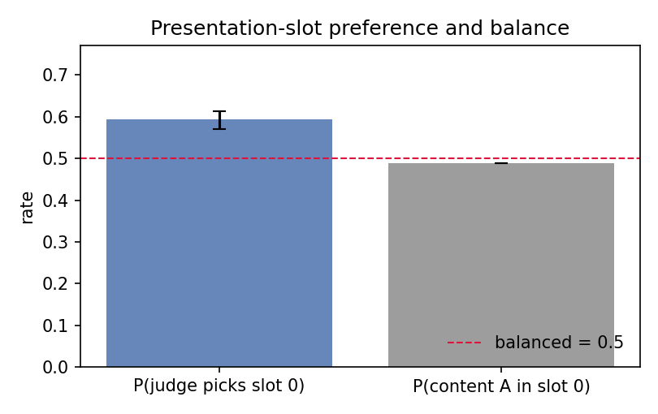
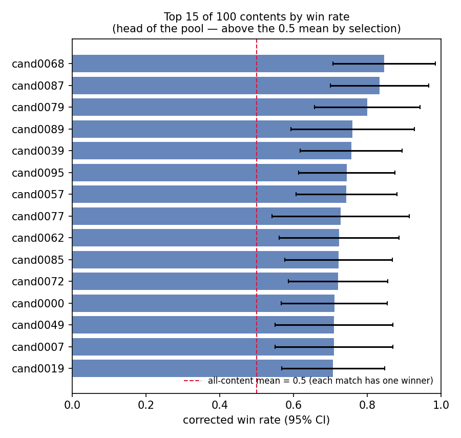

# Pairwise Preference Audit — demo-pairwise-pairwise_biased

*Generated 2026-09-26 · 2000 judgments · 1000 pairs · tie/undecided rate 7.8%*

*Toolkit v0.5.0 · B = 1000 bootstrap · seed 0 · 95% CIs · tests at α = 0.01 — machine-readable results in `results.json`.*

## Summary

| Audit | Key statistic | Value | p-value | Verdict |
|---|---|---|---|---|
| Slot preference | P(judge picks content shown first) | 0.593 [0.571, 0.612] | < 1e-6 | **moderate** |
| Slot balance (design side) | P(content A shown first) | 0.488 | 0.4670 | **balanced** |
| Swap consistency | same winner across both presentation orders | 0.582 [0.546, 0.613] | — | **unstable** |
| Length preference | P(chosen is the longer description) | 0.621 [0.597, 0.644] | — | **severe** |

## 1. Presentation-slot preference

Across 1843 decided judgments: the content shown **first** wins 59.3% of the time [0.571, 0.612] (binomial p = < 1e-6 vs 0.5) → **moderate**.

Design check: content A sits in slot 0 for 48.8% of pairs (p = 0.4670) — balanced, so the slot preference above is confound-free.

## 2. Swap consistency

Across 851 swapped judgment pairs: the same content wins both times **0.582** [0.546, 0.613] → **unstable**. Low consistency means the verdict depends on which order you happened to present — average over orders before drawing conclusions.

## 3. Length preference

The chosen description is the longer one 62.1% of the time [0.597, 0.644] (coin flip 0.5) → **severe**. Mean length advantage of the chosen side: +4.8 chars.

## 4. Corrected leaderboard

| Content | Decided | Wins | Win rate | as first | as second |
|---|---|---|---|---|---|
| cand0068 | 26 | 22 | 0.846 | 0.846 | 0.846 |
| cand0087 | 30 | 25 | 0.833 | 1.000 | 0.667 |
| cand0079 | 30 | 24 | 0.800 | 0.857 | 0.750 |
| cand0089 | 25 | 19 | 0.760 | 0.692 | 0.833 |
| cand0039 | 37 | 28 | 0.757 | 0.842 | 0.667 |
| cand0095 | 43 | 32 | 0.744 | 0.864 | 0.619 |
| cand0057 | 39 | 29 | 0.744 | 0.833 | 0.667 |
| cand0077 | 22 | 16 | 0.727 | 0.800 | 0.667 |
| cand0062 | 29 | 21 | 0.724 | 0.733 | 0.714 |
| cand0085 | 36 | 26 | 0.722 | 0.882 | 0.579 |
| cand0072 | 43 | 31 | 0.721 | 0.810 | 0.636 |
| cand0000 | 38 | 27 | 0.711 | 0.700 | 0.722 |
| cand0049 | 31 | 22 | 0.710 | 0.867 | 0.562 |
| cand0007 | 31 | 22 | 0.710 | 0.933 | 0.500 |
| cand0019 | 41 | 29 | 0.707 | 0.905 | 0.500 |
| cand0041 | 44 | 31 | 0.705 | 0.870 | 0.524 |
| cand0006 | 37 | 26 | 0.703 | 0.789 | 0.611 |
| cand0042 | 40 | 28 | 0.700 | 0.750 | 0.650 |
| cand0033 | 30 | 21 | 0.700 | 0.667 | 0.733 |
| cand0043 | 52 | 36 | 0.692 | 0.741 | 0.640 |
| … (80 more in results.json) | | | | | |

With a balanced design, the overall win rate is order-corrected; the as-first / as-second split exposes content that only wins from one slot.

## Recommendations

- Slot preference detected: randomize (or counterbalance) which content is presented first, and report order-corrected win rates.
- Low swap consistency: judge verdicts depend on presentation order. Average over both orders, or tighten the judge prompt/rubric.
- Length preference detected: the judge favors longer descriptions — control for length (truncate/normalize descriptions) or report length-stratified rates.

## Method notes

- CIs are cluster bootstrap percentile intervals (B = 1000), resampling pairs so repeated judgments of one pair move together.
- Slot preference uses an exact binomial test vs 0.5 on decided judgments; it is confound-free only when the slot-assignment is balanced (checked in §1).
- Swap consistency compares verdicts of the same pair under both presentation orders — order-sensitive judging shows up here, independent of slot balance.
- Length preference measures P(the winner has the longer description) — a *combined* signal: judge preference for longer text AND any length–quality correlation in the content pool (strong contents often have longer descriptions). When it fires on a design you trust, inspect how descriptions were generated before blaming the judge.
- Length CIs cluster on contents (contents recur across pairs), which widens them relative to per-judgment counting; the verdict thresholds account for this.
- The corrected leaderboard splits each content's win rate by presentation slot; large first/second gaps indicate residual order effects.
- Abstains/ties are excluded from preference statistics and reported as the tie rate.
