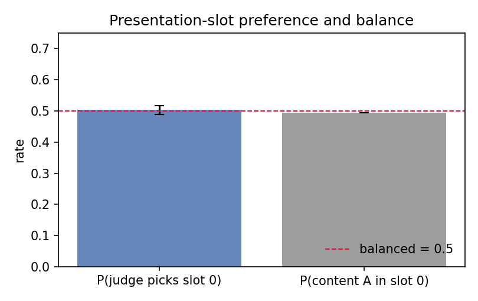
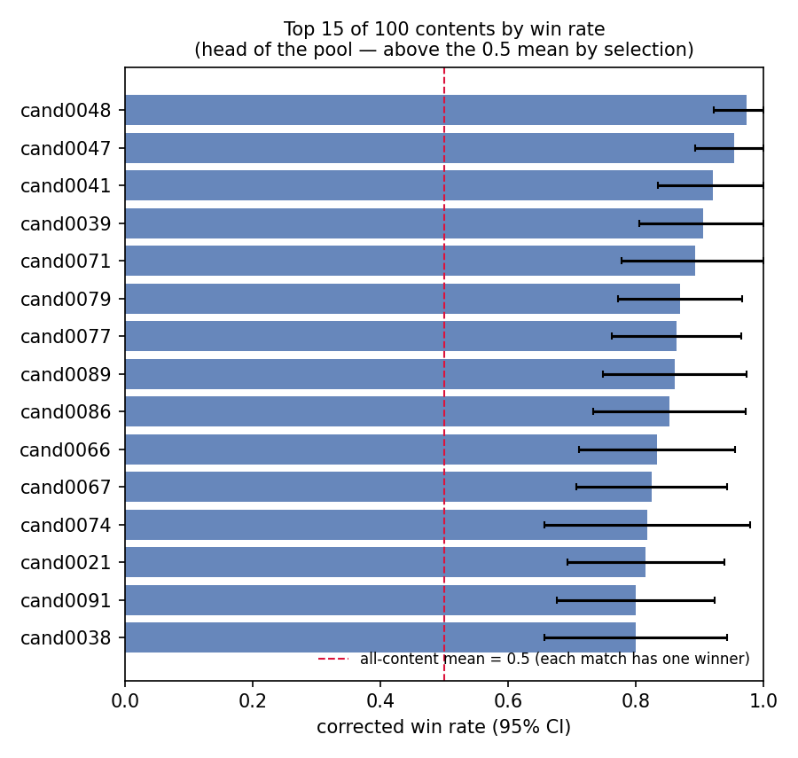

# Pairwise Preference Audit — demo-pairwise-pairwise_clean

*Generated 2026-09-26 · 2000 judgments · 1000 pairs · tie/undecided rate 0.0%*

*Toolkit v0.5.0 · B = 1000 bootstrap · seed 0 · 95% CIs · tests at α = 0.01 — machine-readable results in `results.json`.*

## Summary

| Audit | Key statistic | Value | p-value | Verdict |
|---|---|---|---|---|
| Slot preference | P(judge picks content shown first) | 0.504 [0.488, 0.517] | 0.7373 | **none** |
| Slot balance (design side) | P(content A shown first) | 0.495 | 0.7760 | **balanced** |
| Swap consistency | same winner across both presentation orders | 0.786 [0.761, 0.811] | — | **mostly stable** |
| Length preference | P(chosen is the longer description) | 0.504 [0.467, 0.539] | — | **none** |

## 1. Presentation-slot preference

Across 2000 decided judgments: the content shown **first** wins 50.4% of the time [0.488, 0.517] (binomial p = 0.7373 vs 0.5) → **none**.

Design check: content A sits in slot 0 for 49.5% of pairs (p = 0.7760) — balanced, so the slot preference above is confound-free.

## 2. Swap consistency

Across 1000 swapped judgment pairs: the same content wins both times **0.786** [0.761, 0.811] → **mostly stable**. Low consistency means the verdict depends on which order you happened to present — average over orders before drawing conclusions.

## 3. Length preference

The chosen description is the longer one 50.4% of the time [0.467, 0.539] (coin flip 0.5) → **none**. Mean length advantage of the chosen side: +0.8 chars.

## 4. Corrected leaderboard

| Content | Decided | Wins | Win rate | as first | as second |
|---|---|---|---|---|---|
| cand0048 | 38 | 37 | 0.974 | 0.947 | 1.000 |
| cand0047 | 44 | 42 | 0.955 | 1.000 | 0.909 |
| cand0041 | 38 | 35 | 0.921 | 0.947 | 0.895 |
| cand0039 | 32 | 29 | 0.906 | 0.875 | 0.938 |
| cand0071 | 28 | 25 | 0.893 | 0.929 | 0.857 |
| cand0079 | 46 | 40 | 0.870 | 0.870 | 0.870 |
| cand0077 | 44 | 38 | 0.864 | 0.864 | 0.864 |
| cand0089 | 36 | 31 | 0.861 | 0.889 | 0.833 |
| cand0086 | 34 | 29 | 0.853 | 0.882 | 0.824 |
| cand0066 | 36 | 30 | 0.833 | 0.778 | 0.889 |
| cand0067 | 40 | 33 | 0.825 | 0.800 | 0.850 |
| cand0074 | 22 | 18 | 0.818 | 0.818 | 0.818 |
| cand0021 | 38 | 31 | 0.816 | 0.842 | 0.789 |
| cand0091 | 40 | 32 | 0.800 | 0.700 | 0.900 |
| cand0038 | 30 | 24 | 0.800 | 0.800 | 0.800 |
| cand0046 | 34 | 27 | 0.794 | 0.824 | 0.765 |
| cand0019 | 32 | 25 | 0.781 | 0.812 | 0.750 |
| cand0053 | 36 | 28 | 0.778 | 0.944 | 0.611 |
| cand0042 | 44 | 34 | 0.773 | 0.773 | 0.773 |
| cand0087 | 22 | 17 | 0.773 | 0.818 | 0.727 |
| … (80 more in results.json) | | | | | |

With a balanced design, the overall win rate is order-corrected; the as-first / as-second split exposes content that only wins from one slot.

## Recommendations

- No significant judging bias detected at α = 0.01.

## Method notes

- CIs are cluster bootstrap percentile intervals (B = 1000), resampling pairs so repeated judgments of one pair move together.
- Slot preference uses an exact binomial test vs 0.5 on decided judgments; it is confound-free only when the slot-assignment is balanced (checked in §1).
- Swap consistency compares verdicts of the same pair under both presentation orders — order-sensitive judging shows up here, independent of slot balance.
- Length preference measures P(the winner has the longer description) — a *combined* signal: judge preference for longer text AND any length–quality correlation in the content pool (strong contents often have longer descriptions). When it fires on a design you trust, inspect how descriptions were generated before blaming the judge.
- Length CIs cluster on contents (contents recur across pairs), which widens them relative to per-judgment counting; the verdict thresholds account for this.
- The corrected leaderboard splits each content's win rate by presentation slot; large first/second gaps indicate residual order effects.
- Abstains/ties are excluded from preference statistics and reported as the tie rate.
